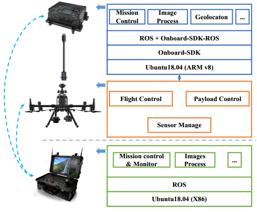
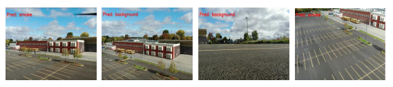
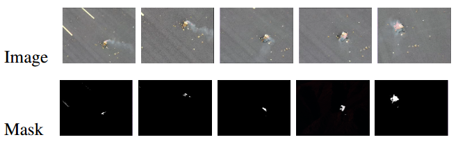
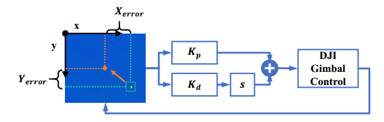
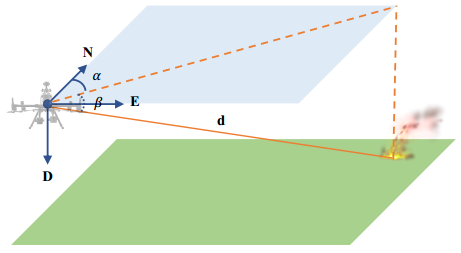
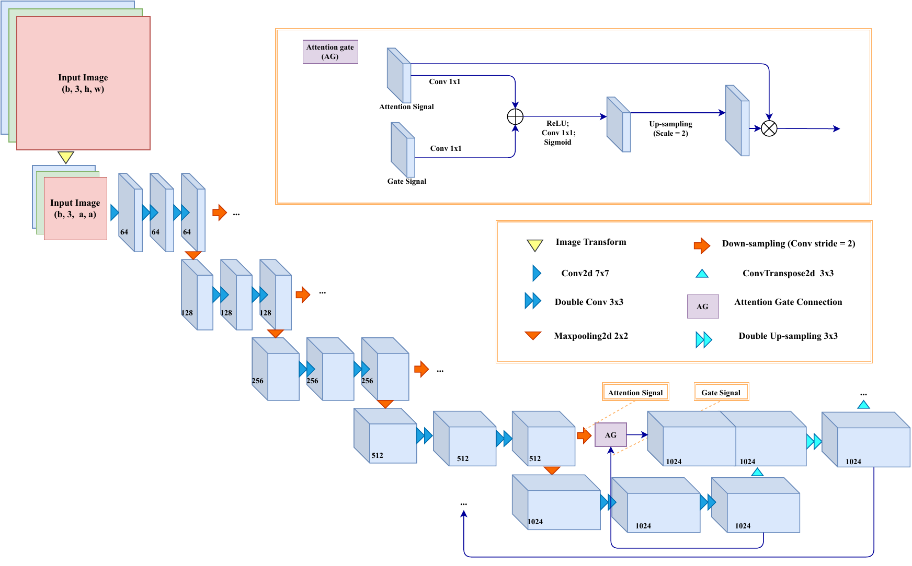
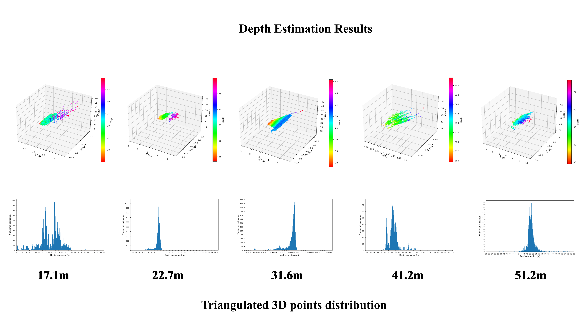
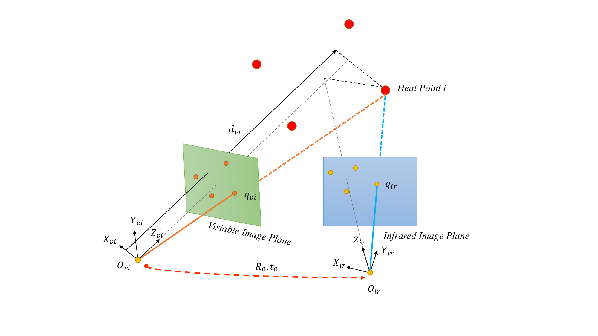
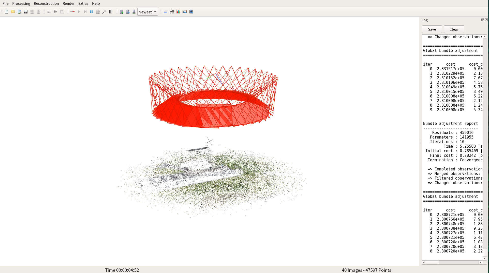
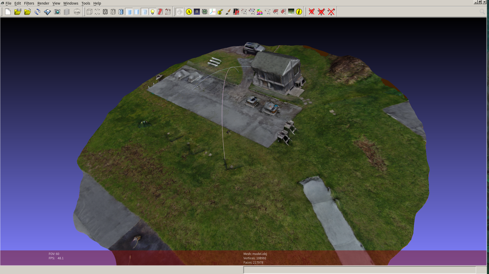

# Forest Fire Detection System

This ROS package is designed for early wildfire detection, geolocation and monitoring.

## System architecture

### 

## Functions

### Early Wildfire Flame and Smoke Segmentation

| functions                        | results                                              |
| -------------------------------- | ---------------------------------------------------- |
| path planning                    |  |
| forest fire image classification |         |
| forest fire image segmentation   |          |
| gimbal control                   |        |
| fire point geolocation           |        |

### Multi-view Geometry-based Wildfire Spot Geolocation

[Early wildfire spot perception methods](https://github.com/ConcordiaNAVlab/early_wildfire_perception)

| functions                                             |                                                                |
| ---------------------------------------------------- | -------------------------------------------------------------- |
| Attention gate U-net wildfire segmentation           |  |
| Trianglulation-based wildfire point depth estimation |                |
| Visible-infrared camera system calibration           |     |
| Model-based wide fire point registration             |                |

### Wildfire Local Environment 3D reconstruction

You can also compare the reconstruction results with [google earth](https://earth.google.com/web/@45.4552362,-73.91587166,25.22623597a,99.51716005d,35y,0.00000001h,49.33917715t,0r).

| SFM with `colmap`                           | Reconstruction with `OpenMVS`               |
| ------------------------------------------- | ------------------------------------------- |
|  |  |
|  |  |

## Outdoor Flight Test Videos

- [Early Wildfire Flame and Smoke Segmentation](https://www.youtube.com/watch?v=dQG73LW8jxQ)

> M300 drone flies along the defined zigzag path, while the attention gate U-net
> is implemented to detect and segment the suspect wildfire.

- [Multi-view Geometry-based Wildfire Spot Geolocation](https://www.youtube.com/watch?v=Sk7nWwYyFZI)

> 1. Once the suspect fire is detected, M300 will fly from left to the right. In
>    the meantime, a monocular SLAM is running to acquire the precise camera
>    pose, the GPS information is used to correct the scale of the poses.
> 2. Based-on the triangulation of the fire zone, the distance can be estimated.
>    Then, the fire can be geolocated by with the gimbal angle.

- [Wildfire Local Environment 3D reconstruction](hhh)

> Finally, M300 will fly along a circle shape of the flight path to record the
> scene of the local environment around the wildfire spot with the H20T zoom
> camera.

## Copyright

**Copyright (C) 2021 Concordia NAVlab. All rights reserved.**
