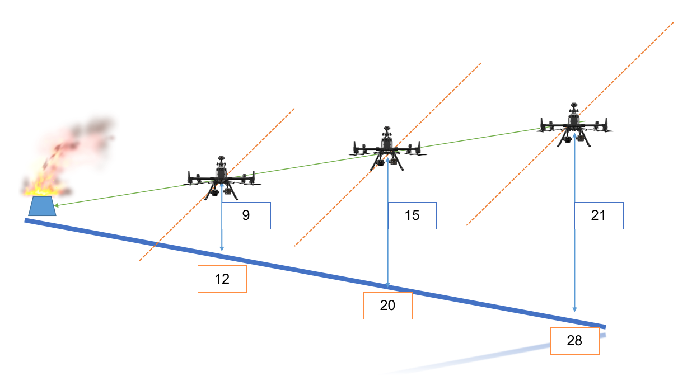
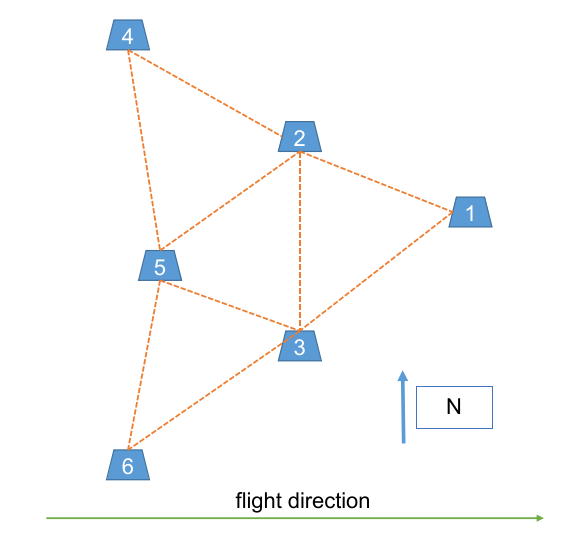

# 深度估计实验数据采集

> Last modified: 一 23 5月 2022 04:06:48 下午

## 实验目的

### 实验1 单火点深度估计实验

获取:

- 激光测距仪测出的单火点火点距离飞机的位置

  | 实验编号 | 地面距离 | 高度 | 激光测距 |
  |----------|----------|------|----------|
  | 01       |          |      |          |
  | 02       |          |      |          |
  | 03       |          |      |          |
  | 04       |          |      |          |
  | 0        |          |      |          |
  | 0        |          |      |          |
  | 0        |          |      |          |

- 飞机在三角测量过程中的每一个时态的GPS位置, 自身姿态以及红外和RGB图像

### 实验 2 多火点 (6个) 深度估计实验

- 火点布置

获取:

- 激光测距仪测出的单火点火点距离飞机的位置

| 实验编号 | 地面距离(6) | 高度 | 1 激光测距 | 2 激光测距 | 3 激光测距 | 4 激光测距 | 5 激光测距 | 6 激光测距 |
|----------|-------------|------|------------|------------|------------|------------|------------|------------|
| 01       |             |      |            |            |            |            |            |            |
| 0        |             |      |            |            |            |            |            |            |
| 0        |             |      |            |            |            |            |            |            |
| 0        |             |      |            |            |            |            |            |            |
| 0        |             |      |            |            |            |            |            |            |
| 0        |             |      |            |            |            |            |            |            |
| 0        |             |      |            |            |            |            |            |            |

- 飞机在三角测量过程中的每一个时态的GPS位置, 自身姿态以及红外和RGB图像

## 实验步骤

1. 点燃火焰, 维持火焰
2. 使用NETGEAR路由器, 上电
3. 笔记本连接无线网络
4. 控开机, 无人机上电,分割屏幕, 调节变焦到2倍. 检查网络连接情况
5. 运行程序, 开始进行采集
6. 降落之后, 将数据拷贝到地面站电脑之上

### 运行程序

- `dji`主节点
- 分割屏幕
- 执行任务

